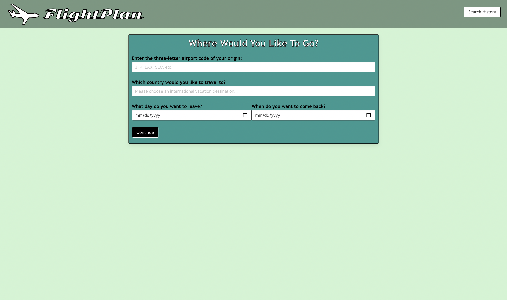

# FlightRoulette

## User Story

AS A user that likes to travel on a budget
I WANT to be able to find cheap flights to places I want to go in my budget
SO THAT I can see the world without breaking my bank

## Acceptance Criteria

GIVEN I am using a travel budget app to find places to travel
WHEN I open the app
THEN I input the travel destination
WHEN I input a destination and click "continue" a budget input card appears
THEN I input budget data
WHEN I click "submit" location cards appear with data for price of flights and currency conversions
THEN each searched item is saved in the search history
WHEN I refresh the page
THEN the saved searches remain in searched history

## Mock Up 

## URLs

The URL of the deployed application.

The URL of the GitHub repository.

